# Finnect Guard 기능 구조 및 앱 워크플로우 정의서

> **목적**  
> 본 문서는 Finnect Guard의 최종 기능 구조를 정리하고, 스마트폰 뱅킹 앱 형태의 HTML 목업에서 구현 가능한 모든 주요 워크플로우를 정의하기 위한 기획 명세서이다.  
> 목업 제작 시 각 화면, 버튼, 위험도 분기, 사용자 선택 결과를 그대로 시뮬레이션할 수 있도록 작성하였다.

---

## 1. 서비스 정의

### 1.1 한 줄 정의

**Finnect Guard는 사용자가 대출, 카드 발급, 송금, 자동이체, 소비, 의심입금 대응 같은 금융 행동을 실행하기 전, 그 행동이 만들 비용·위험·책임을 AI가 쉬운 말로 보여주고, 위험하면 잠시 멈추게 하며, 문제 발생 시 신고기록까지 자동 정리하는 AI 금융 안전벨트 서비스이다.**

### 1.2 짧은 설명

> **누르기 전에 보여주고, 위험하면 멈추고, 문제 생기면 기록까지 남기는 AI 금융 안전벨트.**

### 1.3 핵심 문제의식

기존 금융 앱은 사용자가 **빠르게 가입하고, 빠르게 송금하고, 빠르게 결제하게 만드는 UX**에 집중한다.  
하지만 실제 금융 취약 사용자는 버튼을 누르기 전 다음을 충분히 이해하지 못한다.

- 이 대출을 받으면 매달 얼마를 갚아야 하는지
- 리볼빙을 신청하면 다음 달 이후 이자가 어떻게 붙는지
- 자동이체를 추가하면 월말 생활비가 부족해지는지
- 송금 상대와 계좌 명의가 다른 경우 어떤 위험이 있는지
- 모르는 사람이 보낸 입금을 바로 사용해도 되는지
- 배달·쇼핑·구독 결제가 이번 달 생활비를 침범하는지
- 사고가 났을 때 어떤 기록을 남겨야 하는지

Finnect Guard는 이러한 문제를 **금융 행동 직전 개입** 방식으로 해결한다.

---

## 2. 최종 확정 용어

| 구분 | 확정 용어 | 설명 |
|---|---|---|
| 서비스명 | **Finnect Guard** | 금융 행동을 보호하는 AI 안전벨트 |
| 서비스 설명 | **AI 금융 안전벨트** | 금융 버튼을 누르기 전 위험을 확인하고 멈추게 하는 보호 장치 |
| 핵심 시장 | **금융 행동 보호 시장** | 약관 요약, 금융교육, 사기 신고가 아니라 행동 직전 보호에 초점 |
| 기능 1 | **금융행동 위험진단** | 사용자가 하려는 금융 행동의 위험도를 AI가 분석 |
| 기능 2 | **쉬운말 핵심설명** | 어려운 약관과 금융 용어를 쉬운 말로 변환 |
| 기능 3 | **돈흐름 미리보기** | 버튼을 누른 뒤 1개월·3개월·최악 상황의 돈 흐름 예측 |
| 기능 4 | **생활비 보호모드** | 필수 생활비를 먼저 지키고 충동소비를 잠시 멈추게 함 |
| 기능 5 | **위험거래 잠시멈춤** | 고위험 송금, 의심입금, 리볼빙, 고금리 대출을 즉시 실행하지 않게 함 |
| 기능 5 하위 | **의심입금 안전확인** | 모르는 입금을 수락·보류·반환·신고 중 선택 |
| 기능 6 | **신고기록 자동정리** | 위험 경고, 사용자 선택, 대화·입출금 내역을 신고용 기록으로 정리 |
| MVP 이름 | **누르기 전 금융 안전확인** | 공모전용 MVP 명칭 |
| 대표 문장 | **누르기 전에 보여주고, 위험하면 멈추고, 문제 생기면 기록까지 남긴다.** | 발표용 핵심 문장 |

---

## 3. 최종 6대 기능 구조

| 번호 | 기능명 | 역할 | 사용자가 보는 문구 예시 |
|---:|---|---|---|
| 1 | **금융행동 위험진단** | 대출, 카드, 송금, 입금, 자동이체, 소비 행동의 위험도를 AI가 진단 | “지금 하려는 금융 행동을 분석했어요.” |
| 2 | **쉬운말 핵심설명** | 약관, 금융 용어, 수수료, 연체, 리볼빙 등을 쉬운 말로 설명 | “꼭 알아야 할 위험만 쉽게 설명할게요.” |
| 3 | **돈흐름 미리보기** | 지금 누르면 1개월 뒤, 3개월 뒤, 최악의 상황에서 돈이 어떻게 변하는지 예측 | “이 버튼을 누르면 앞으로 돈이 이렇게 움직여요.” |
| 4 | **생활비 보호모드** | 필수 생활비를 제외한 돈을 보호하고, 충동소비 전 사유 입력·쿨링오프 제공 | “이번 결제는 생활비를 침범할 수 있어요.” |
| 5 | **위험거래 잠시멈춤** | 고위험 송금, 의심입금, 리볼빙, 고금리 대출을 바로 실행하지 않고 보류 | “위험 신호가 있어요. 바로 진행하지 말고 한 번 더 확인하세요.” |
| 6 | **신고기록 자동정리** | 사고 발생 가능성이 있는 거래의 경고·선택·증거 기록을 자동 정리 | “문제가 생길 경우를 대비해 신고용 기록을 정리했어요.” |

---

## 4. 서비스 논리적 아키텍처

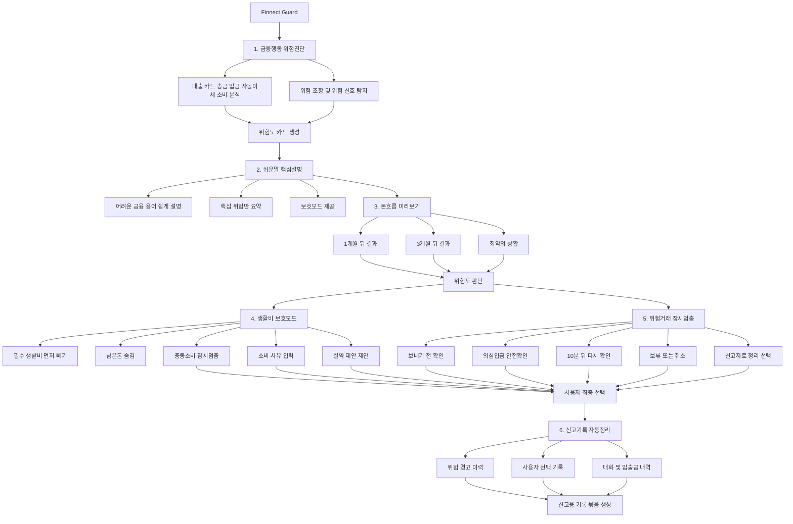
```mermaid
graph TD
    A["Finnect Guard"]

    A --> B["1. 금융행동 위험진단"]
    B --> B1["대출 카드 송금 입금 자동이체 소비 분석"]
    B --> B2["위험 조항 및 위험 신호 탐지"]
    B1 --> B3["위험도 카드 생성"]
    B2 --> B3

    B3 --> C["2. 쉬운말 핵심설명"]
    C --> C1["어려운 금융 용어 쉽게 설명"]
    C --> C2["핵심 위험만 요약"]
    C --> C3["보호모드 제공"]

    C --> D["3. 돈흐름 미리보기"]
    D --> D1["1개월 뒤 결과"]
    D --> D2["3개월 뒤 결과"]
    D --> D3["최악의 상황"]
    D1 --> D4["위험도 판단"]
    D2 --> D4
    D3 --> D4

    D4 --> E["4. 생활비 보호모드"]
    E --> E1["필수 생활비 먼저 빼기"]
    E --> E2["남은돈 숨김"]
    E --> E3["충동소비 잠시멈춤"]
    E --> E4["소비 사유 입력"]
    E --> E5["절약 대안 제안"]

    D4 --> F["5. 위험거래 잠시멈춤"]
    F --> F1["보내기 전 확인"]
    F --> F2["의심입금 안전확인"]
    F --> F3["10분 뒤 다시 확인"]
    F --> F4["보류 또는 취소"]
    F --> F5["신고자료 정리 선택"]

    E3 --> G["사용자 최종 선택"]
    E4 --> G
    E5 --> G
    F1 --> G
    F2 --> G
    F3 --> G
    F4 --> G
    F5 --> G

    G --> H["6. 신고기록 자동정리"]
    H --> H1["위험 경고 이력"]
    H --> H2["사용자 선택 기록"]
    H --> H3["대화 및 입출금 내역"]
    H1 --> H4["신고용 기록 묶음 생성"]
    H2 --> H4
    H3 --> H4
```

---

## 5. 앱 정보 구조

### 5.1 하단 탭 구조

| 탭 | 목적 | 주요 화면 |
|---|---|---|
| **홈** | 현재 위험 상태와 빠른 실행 | 이번 달 생활비, 보호 중인 돈, 최근 위험진단 |
| **위험진단** | 약관·대출·카드·송금·입금 분석 | 화면 업로드, 직접 입력, 위험도 카드 |
| **돈흐름** | 미래 비용과 현금흐름 확인 | 1개월 뒤, 3개월 뒤, 최악의 상황 |
| **생활비** | 생활비 보호와 절약 관리 | 필수 생활비, 남은돈 숨김, 절약 성공 기록 |
| **기록** | 신고기록과 보류 이력 관리 | 신고용 기록 묶음, 보류한 거래, 경고 이력 |
| **설정** | 보호모드와 알림 설정 | 쉬운말 단계, 고령층 모드, 외국어 모드, 쿨링오프 시간 |

### 5.2 홈 화면 핵심 카드

| 카드명 | 내용 |
|---|---|
| **오늘의 사용 가능 금액** | 필수 생활비를 제외하고 오늘 써도 되는 금액 |
| **보호 중인 금액** | 바로 보이지 않도록 숨긴 금액 |
| **이번 달 지켜낸 금액** | 충동소비 잠시멈춤으로 보류·취소한 금액 |
| **최근 위험진단** | 최근 분석한 대출, 카드, 송금, 입금 위험도 |
| **빠른 실행 버튼** | 위험 확인하기, 돈흐름 미리보기, 이 입금 안전확인, 신고기록 보기 |

---

## 6. 위험도 체계

| 위험도 | 표시 문구 | 의미 | 기본 행동 |
|---|---|---|---|
| 1단계 | **안전 확인** | 큰 위험 신호 없음 | 진행 가능 |
| 2단계 | **확인 필요** | 일부 조건 확인 필요 | 쉬운말 설명 후 진행 |
| 3단계 | **위험 신호 있음** | 생활비 부족, 명의 불일치, 고금리 등 위험 존재 | 잠시멈춤 권장 |
| 4단계 | **즉시 중단 권장** | 사기, 연체, 과도한 상환 부담 가능성 높음 | 보류·취소·신고자료 정리 권장 |

---

## 7. 사용자 유형별 보호모드

| 사용자 유형 | 보호 방식 |
|---|---|
| 사회초년생 | 대출, 카드, 리볼빙, 자동이체 조건을 쉬운 말로 설명 |
| 저소득 청년 | 생활비 부족 위험, 월말 현금흐름 부족 위험을 우선 경고 |
| 충동소비 취약 사용자 | 소비 전 사유 입력, 10분 뒤 다시 확인, 장바구니 보관 제안 |
| 중고거래 사용자 | 송금 전 계좌 명의 확인, 의심입금 안전확인, 삼자사기 경고 |
| 프리랜서·소상공인 | 거래처명·입금자명 불일치, 정산 오류, 세금계산서 금액 불일치 경고 |
| 고령층 | 큰 글씨, 핵심 위험 반복, 느린 확인 버튼 |
| 외국인·다문화 사용자 | 쉬운 한국어, 다국어 설명, 한국 금융 용어 해석 |

---

# 8. 앱에서 가능한 전체 워크플로우 정의

---

## WF-00. 온보딩 및 보호 설정 워크플로우

### 목적
사용자의 금융 취약 지점과 보호 수준을 설정한다.

### 흐름

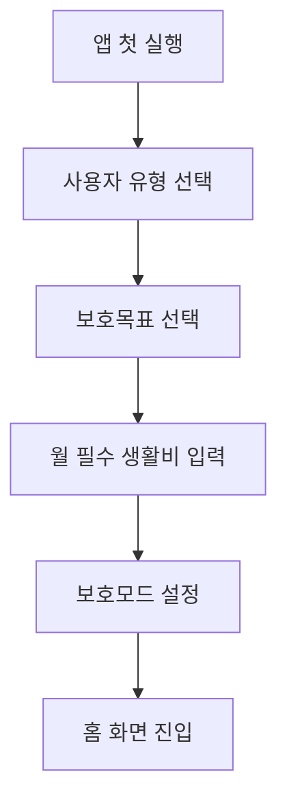
```mermaid
graph TD
    A["앱 첫 실행"] --> B["사용자 유형 선택"]
    B --> C["보호목표 선택"]
    C --> D["월 필수 생활비 입력"]
    D --> E["보호모드 설정"]
    E --> F["홈 화면 진입"]
```

### 화면 단계

| 단계 | 화면 | 사용자 입력 |
|---:|---|---|
| 1 | 시작 화면 | 서비스 설명 확인 |
| 2 | 사용자 유형 선택 | 사회초년생, 중고거래 사용자, 프리랜서, 고령층, 외국인 등 |
| 3 | 보호목표 선택 | 과소비 방지, 대출 위험 확인, 송금사기 예방, 의심입금 대응 |
| 4 | 생활비 입력 | 월세, 통신비, 교통비, 식비, 카드값, 대출상환액 |
| 5 | 보호모드 설정 | 쿨링오프 시간, 쉬운말 단계, 알림 강도 |
| 6 | 홈 진입 | 오늘 사용 가능 금액 확인 |

### 목업 버튼
- 시작하기
- 내 보호목표 고르기
- 생활비 입력하기
- 나중에 설정하기
- 보호모드 켜기

---

## WF-01. 금융행동 위험진단 기본 워크플로우

### 목적
사용자가 하려는 금융 행동을 AI가 인식하고 위험도를 카드로 보여준다.

### 흐름

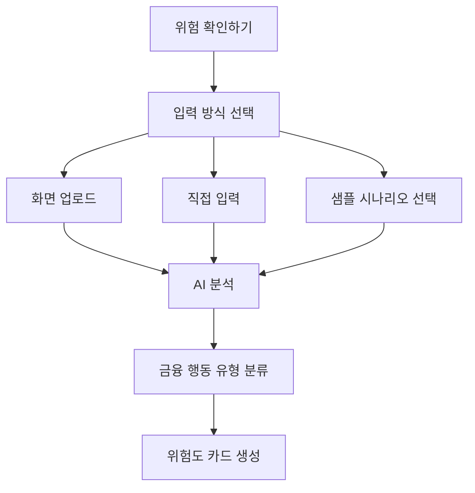
```mermaid
graph TD
    A["위험 확인하기"] --> B["입력 방식 선택"]
    B --> C["화면 업로드"]
    B --> D["직접 입력"]
    B --> E["샘플 시나리오 선택"]
    C --> F["AI 분석"]
    D --> F
    E --> F
    F --> G["금융 행동 유형 분류"]
    G --> H["위험도 카드 생성"]
```

### 입력 유형

| 입력 방식 | 예시 |
|---|---|
| 화면 업로드 | 카드 발급 화면, 대출 신청 화면, 송금 화면, 입금 내역 캡처 |
| 텍스트 입력 | 약관 문장, 입금자명, 거래 메모, 금액 |
| 직접 선택 | 대출, 카드, 자동이체, 송금, 입금, 소비, 구독 |
| 샘플 실행 | 목업용 테스트 시나리오 선택 |

### 출력 카드

| 출력 항목 | 예시 |
|---|---|
| 금융 행동 | 소액대출 신청 |
| 위험도 | 위험 신호 있음 |
| 핵심 위험 | 월 상환 부담, 연체이자, 신용점수 하락 |
| 추천 행동 | 돈흐름 미리보기, 잠시멈춤, 금액 낮추기 |

---

## WF-02. 약관 위험진단 워크플로우

### 목적
긴 약관에서 사용자가 반드시 봐야 할 위험 조항만 추출한다.

### 흐름

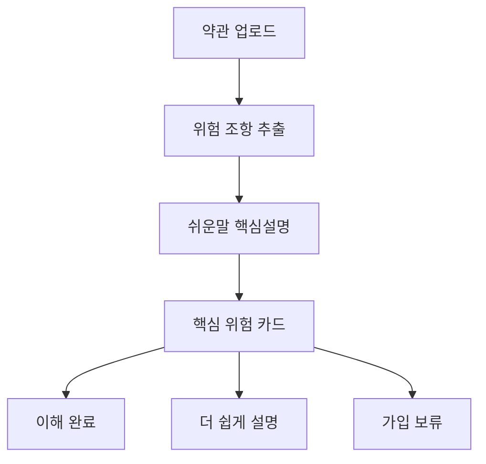
```mermaid
graph TD
    A["약관 업로드"] --> B["위험 조항 추출"]
    B --> C["쉬운말 핵심설명"]
    C --> D["핵심 위험 카드"]
    D --> E["이해 완료"]
    D --> F["더 쉽게 설명"]
    D --> G["가입 보류"]
```

### 탐지 조항

| 조항 유형 | 위험 설명 |
|---|---|
| 연체이자 | 정해진 날에 못 갚으면 추가 비용 발생 |
| 리볼빙 | 카드값을 미루는 대신 이자 발생 |
| 중도상환수수료 | 대출을 빨리 갚아도 비용이 생길 수 있음 |
| 자동갱신 | 해지하지 않으면 계약이 계속 이어짐 |
| 개인정보 제3자 제공 | 내 정보가 다른 회사에 전달될 수 있음 |
| 실적 조건 | 혜택을 받으려면 매달 일정 금액 이상 써야 함 |

### 사용자 선택
- 이해했어요
- 더 쉽게 설명해줘
- 돈흐름 미리보기
- 가입 보류하기

---

## WF-03. 대출 돈흐름 미리보기 워크플로우

### 목적
대출 실행 전 월 상환 부담과 최악의 상황을 보여준다.

### 흐름

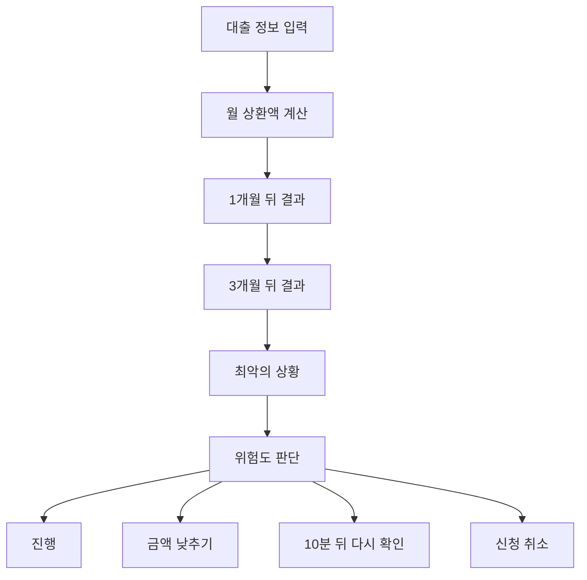
```mermaid
graph TD
    A["대출 정보 입력"] --> B["월 상환액 계산"]
    B --> C["1개월 뒤 결과"]
    C --> D["3개월 뒤 결과"]
    D --> E["최악의 상황"]
    E --> F["위험도 판단"]
    F --> G["진행"]
    F --> H["금액 낮추기"]
    F --> I["10분 뒤 다시 확인"]
    F --> J["신청 취소"]
```

### 입력값

| 항목 | 예시 |
|---|---|
| 대출금 | 3,000,000원 |
| 금리 | 연 12.5% |
| 기간 | 12개월 |
| 월소득 | 800,000원 |
| 기존 고정지출 | 520,000원 |

### 결과 화면

| 시점 | 표시 내용 |
|---|---|
| 현재 | 대출 실행 금액과 실제 입금액 |
| 1개월 뒤 | 첫 월 상환액 |
| 3개월 뒤 | 누적 상환액과 남은 생활비 |
| 최악의 상황 | 연체이자, 신용점수 하락 가능성, 생활비 부족 |

### 목업 문구
> 지금 대출을 받으면 매달 약 261,000원이 빠져나가요.  
> 월소득 800,000원 기준 상환 부담이 높아요.  
> 10분 뒤 다시 확인하거나 금액을 낮춰보는 것을 권장해요.

---

## WF-04. 카드 발급 및 리볼빙 위험 워크플로우

### 목적
카드 발급, 리볼빙, 실적 조건, 연회비의 위험을 보여준다.

### 흐름

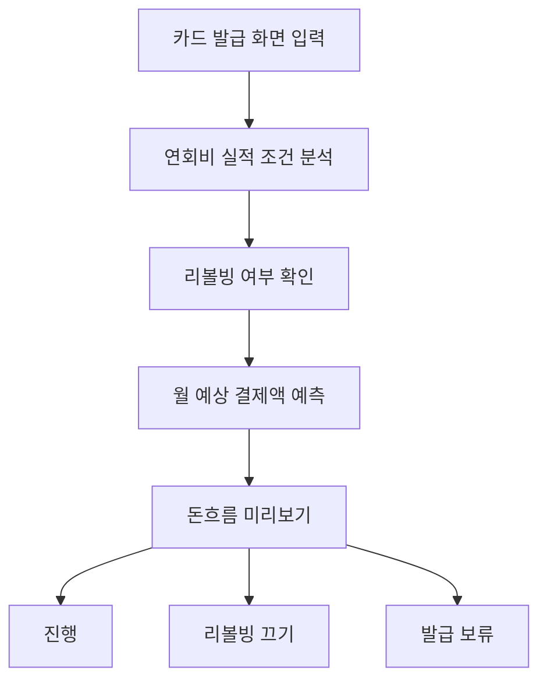
```mermaid
graph TD
    A["카드 발급 화면 입력"] --> B["연회비 실적 조건 분석"]
    B --> C["리볼빙 여부 확인"]
    C --> D["월 예상 결제액 예측"]
    D --> E["돈흐름 미리보기"]
    E --> F["진행"]
    E --> G["리볼빙 끄기"]
    E --> H["발급 보류"]
```

### 위험 신호

| 신호 | 설명 |
|---|---|
| 연회비 높음 | 혜택보다 비용이 클 수 있음 |
| 실적 조건 복잡 | 혜택을 받기 위해 과소비할 수 있음 |
| 리볼빙 기본 노출 | 일부 결제금액 이월로 이자 발생 가능 |
| 월말 잔액 부족 | 결제일에 잔액이 부족할 수 있음 |

### 사용자 선택
- 위험 이해하고 발급
- 리볼빙 없이 발급
- 발급 보류
- 다른 카드 비교

---

## WF-05. 자동이체·구독 결제 점검 워크플로우

### 목적
자동이체와 구독이 월 고정지출을 늘리는지 확인한다.

### 흐름

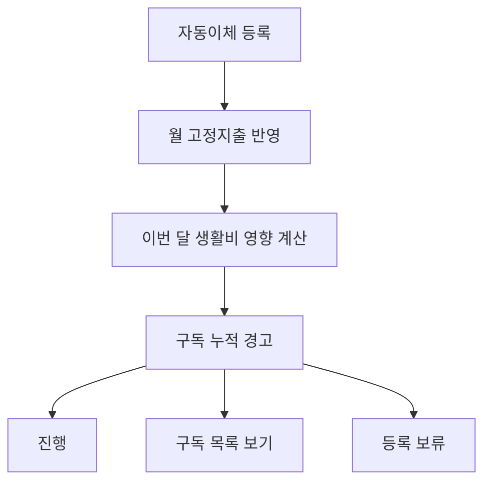
```mermaid
graph TD
    A["자동이체 등록"] --> B["월 고정지출 반영"]
    B --> C["이번 달 생활비 영향 계산"]
    C --> D["구독 누적 경고"]
    D --> E["진행"]
    D --> F["구독 목록 보기"]
    D --> G["등록 보류"]
```

### 점검 항목

| 항목 | 내용 |
|---|---|
| 결제일 | 월급 전후인지 |
| 월 결제액 | 생활비 대비 부담 |
| 해지 조건 | 앱에서 바로 해지 가능한지 |
| 중복 구독 | 비슷한 서비스가 여러 개인지 |
| 사용 빈도 | 최근 사용이 거의 없는지 |

### 목업 문구
> 이번 자동이체를 등록하면 매월 고정지출이 18,900원 늘어나요.  
> 이번 달 자동결제 총액은 74,000원이에요.  
> 사용하지 않는 구독이 있는지 확인해볼까요?

---

## WF-06. 생활비 보호모드 설정 워크플로우

### 목적
필수 생활비를 먼저 보호하고, 실제로 써도 되는 금액만 보여준다.

### 흐름

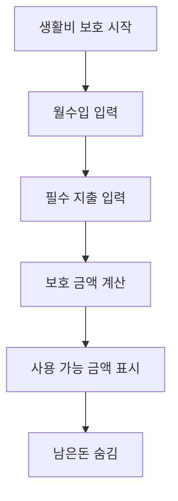
```mermaid
graph TD
    A["생활비 보호 시작"] --> B["월수입 입력"]
    B --> C["필수 지출 입력"]
    C --> D["보호 금액 계산"]
    D --> E["사용 가능 금액 표시"]
    E --> F["남은돈 숨김"]
```

### 입력 항목

| 항목 | 예시 |
|---|---|
| 월수입 | 1,800,000원 |
| 월세 | 500,000원 |
| 통신비 | 70,000원 |
| 교통비 | 90,000원 |
| 식비 | 400,000원 |
| 카드값 | 300,000원 |
| 대출상환 | 150,000원 |

### 출력 항목

| 항목 | 예시 |
|---|---|
| 필수 생활비 | 1,510,000원 |
| 보호 중인 금액 | 200,000원 |
| 오늘 사용 가능 금액 | 30,000원 |
| 이번 달 여유 금액 | 90,000원 |

### 목업 문구
> 이번 달 꼭 필요한 돈을 먼저 지켜뒀어요.  
> 통장에는 돈이 있어도 전부 써도 되는 돈은 아니에요.

---

## WF-07. 충동소비 잠시멈춤 워크플로우

### 목적
배달, 쇼핑, 게임결제, 구독 등 비필수 소비 전 사유 입력과 대기 시간을 제공한다.

### 흐름

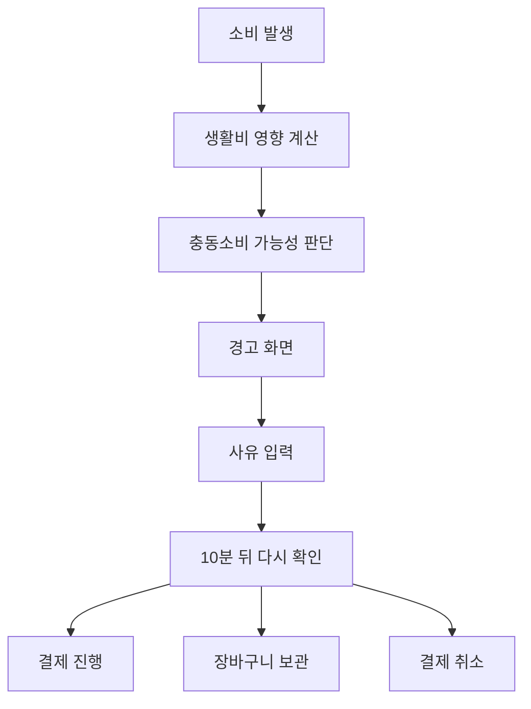
```mermaid
graph TD
    A["소비 발생"] --> B["생활비 영향 계산"]
    B --> C["충동소비 가능성 판단"]
    C --> D["경고 화면"]
    D --> E["사유 입력"]
    E --> F["10분 뒤 다시 확인"]
    F --> G["결제 진행"]
    F --> H["장바구니 보관"]
    F --> I["결제 취소"]
```

### 충동소비 위험 신호

| 신호 | 예시 |
|---|---|
| 심야 결제 | 밤 11시 이후 쇼핑·배달 |
| 반복 결제 | 같은 카테고리에서 짧은 시간 내 반복 결제 |
| 예산 초과 | 이번 주 식비·쇼핑 예산 초과 |
| 월말 잔액 부족 | 결제 후 필수 생활비 부족 |
| 구독 누적 | 자동결제 총액 증가 |

### 사용자 선택
- 위험 이해하고 결제
- 10분 뒤 다시 확인
- 내일 다시 알림
- 장바구니에만 담기
- 결제 취소

### 목업 문구
> 이 결제를 하면 이번 주 식비 예산을 넘어요.  
> 지금 꼭 사야 하는 이유를 적어주세요.

---

## WF-08. 절약 성공 기록 워크플로우

### 목적
잠시멈춤으로 보류·취소한 금액을 사용자에게 성과로 보여준다.

### 흐름

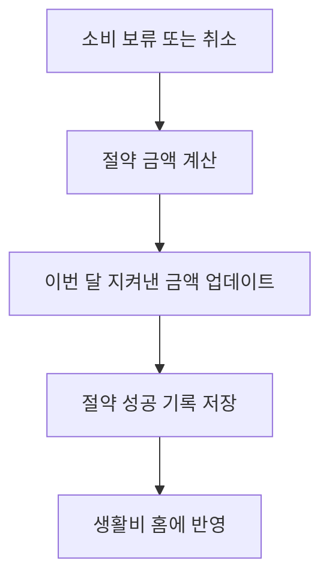
```mermaid
graph TD
    A["소비 보류 또는 취소"] --> B["절약 금액 계산"]
    B --> C["이번 달 지켜낸 금액 업데이트"]
    C --> D["절약 성공 기록 저장"]
    D --> E["생활비 홈에 반영"]
```

### 기록 항목

| 항목 | 예시 |
|---|---|
| 보류한 소비 | 배달앱 28,000원 |
| 취소한 소비 | 쇼핑몰 58,000원 |
| 절약 성공 금액 | 86,000원 |
| 절약 이유 | 식비 예산 초과 |
| 다음 제안 | 내일 점심 예산 12,000원 유지 |

### 목업 문구
> 방금 58,000원 소비를 잠시 멈췄어요.  
> 이번 달 Finnect Guard가 지켜낸 금액은 214,000원이에요.

---

## WF-09. 송금 전 위험확인 워크플로우

### 목적
송금 버튼을 누르기 전 사기 가능성과 계좌 명의 불일치를 점검한다.

### 흐름

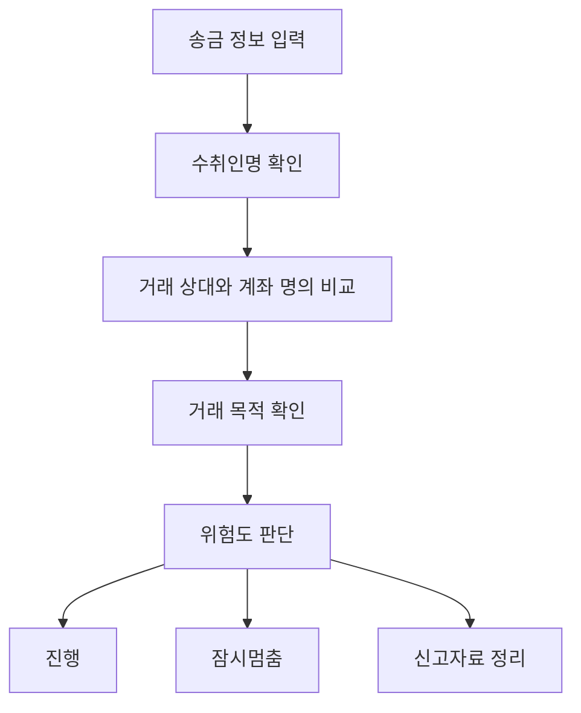
```mermaid
graph TD
    A["송금 정보 입력"] --> B["수취인명 확인"]
    B --> C["거래 상대와 계좌 명의 비교"]
    C --> D["거래 목적 확인"]
    D --> E["위험도 판단"]
    E --> F["진행"]
    E --> G["잠시멈춤"]
    E --> H["신고자료 정리"]
```

### 위험 신호

| 신호 | 설명 |
|---|---|
| 계좌 명의 불일치 | 거래 상대와 수취인명이 다름 |
| 첫 거래 | 이전 거래 이력이 없음 |
| 고액 송금 | 평소보다 큰 금액 |
| 급박한 요구 | “지금 바로 보내라”는 메시지 |
| 외부 링크 유도 | 안전결제 대신 외부 계좌 유도 |

### 사용자 선택
- 위험 이해하고 송금
- 10분 뒤 다시 확인
- 거래 상대에게 명의 확인 요청
- 송금 취소
- 신고자료 정리

---

## WF-10. 의심입금 안전확인 워크플로우

### 목적
모르는 사람이 보낸 돈이나 거래 맥락이 맞지 않는 입금을 바로 사용하지 않도록 돕는다.

### 흐름

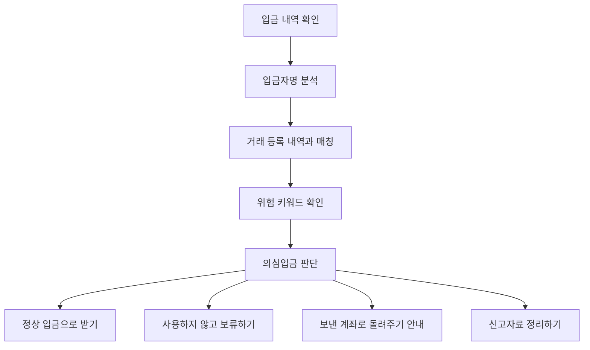
```mermaid
graph TD
    A["입금 내역 확인"] --> B["입금자명 분석"]
    B --> C["거래 등록 내역과 매칭"]
    C --> D["위험 키워드 확인"]
    D --> E["의심입금 판단"]
    E --> F["정상 입금으로 받기"]
    E --> G["사용하지 않고 보류하기"]
    E --> H["보낸 계좌로 돌려주기 안내"]
    E --> I["신고자료 정리하기"]
```

### 위험 신호

| 신호 | 예시 |
|---|---|
| 입금자명 불일치 | 거래 상대는 김OO인데 입금자는 박OO |
| 금액 불일치 | 판매금액 50,000원인데 500,000원 입금 |
| 입금 직후 반환 요구 | “실수로 보냈으니 다른 계좌로 보내주세요” |
| 위험 메모 | 환불, 대여, 착오, 보증금 등 |
| 처음 보는 계좌 | 거래 이력이 전혀 없음 |

### 사용자 선택

| 버튼 | 의미 |
|---|---|
| **정상 입금으로 받기** | 내가 아는 정상 거래라고 확인 |
| **사용하지 않고 보류하기** | 입금액을 건드리지 않고 기록 유지 |
| **보낸 계좌로 돌려주기** | 다른 계좌가 아니라 원입금 경로 기준 반환 안내 |
| **신고자료 정리하기** | 입금내역, 대화, 위험 신호를 신고용으로 정리 |

---

## WF-11. 프리랜서·소상공인 입금 점검 워크플로우

### 목적
거래처 사칭, 정산 오류, 의심입금으로 인한 계좌 리스크를 줄인다.

### 흐름

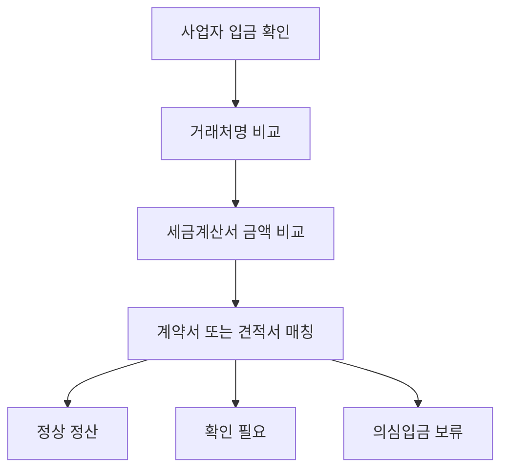
```mermaid
graph TD
    A["사업자 입금 확인"] --> B["거래처명 비교"]
    B --> C["세금계산서 금액 비교"]
    C --> D["계약서 또는 견적서 매칭"]
    D --> E["정상 정산"]
    D --> F["확인 필요"]
    D --> G["의심입금 보류"]
```

### 점검 항목

| 항목 | 설명 |
|---|---|
| 거래처명 | 등록된 거래처와 입금자명이 같은지 |
| 청구 금액 | 세금계산서·견적서 금액과 일치하는지 |
| 입금 시점 | 계약서상 지급일과 일치하는지 |
| 반환 요청 | 원래 계좌가 아닌 제3계좌 반환 요구가 있는지 |
| 반복성 | 기존 거래 이력이 있는지 |

### 목업 문구
> 등록된 거래처명과 입금자명이 달라요.  
> 정산 오류나 거래처 사칭 가능성이 있으니 확인이 필요해요.

---

## WF-12. 위험거래 잠시멈춤 공통 워크플로우

### 목적
위험도가 높은 행동을 즉시 실행하지 않고 한 번 더 생각하게 한다.

### 흐름

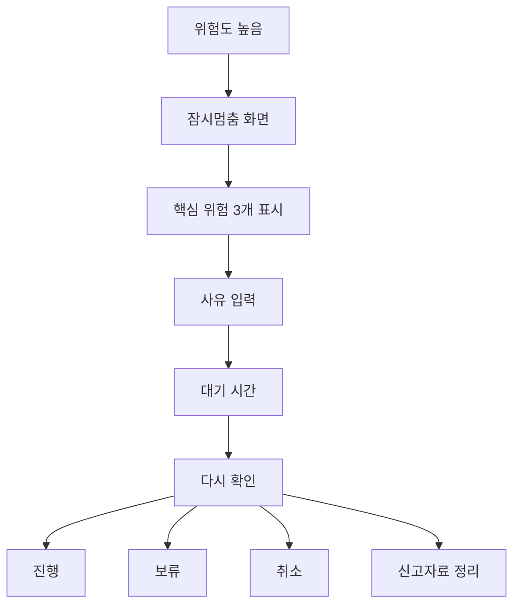
```mermaid
graph TD
    A["위험도 높음"] --> B["잠시멈춤 화면"]
    B --> C["핵심 위험 3개 표시"]
    C --> D["사유 입력"]
    D --> E["대기 시간"]
    E --> F["다시 확인"]
    F --> G["진행"]
    F --> H["보류"]
    F --> I["취소"]
    F --> J["신고자료 정리"]
```

### 잠시멈춤이 필요한 경우

| 유형 | 예시 |
|---|---|
| 고위험 대출 | 월 상환액이 소득 대비 과도함 |
| 리볼빙 | 이자 부담이 커질 수 있음 |
| 고액 송금 | 평소보다 큰 금액 |
| 명의 불일치 송금 | 거래 상대와 계좌 명의 다름 |
| 낯선 입금 | 모르는 사람의 입금 |
| 생활비 침범 소비 | 결제 후 필수 생활비 부족 |
| 자동이체 과다 | 고정지출이 과도하게 증가 |

### 기본 버튼
- 위험 이해하고 진행
- 잠시 멈추기
- 10분 뒤 다시 확인
- 이번 거래 취소
- 신고자료 정리하기

---

## WF-13. 신고기록 자동정리 워크플로우

### 목적
위험 경고와 사용자의 선택을 상담·신고·분쟁 대응용 기록으로 정리한다.

### 흐름

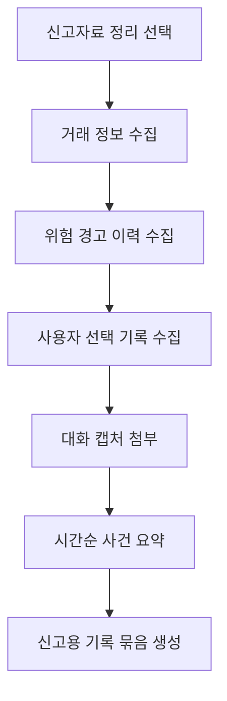
```mermaid
graph TD
    A["신고자료 정리 선택"] --> B["거래 정보 수집"]
    B --> C["위험 경고 이력 수집"]
    C --> D["사용자 선택 기록 수집"]
    D --> E["대화 캡처 첨부"]
    E --> F["시간순 사건 요약"]
    F --> G["신고용 기록 묶음 생성"]
```

### 자동 정리 항목

| 항목 | 예시 |
|---|---|
| 거래 일시 | 2026-05-24 14:32 |
| 거래 유형 | 중고거래 입금 |
| 입금자명 | 박OO |
| 거래 상대 | 김OO |
| 금액 | 500,000원 |
| 위험 신호 | 입금자명 불일치, 과다 입금 |
| 사용자 선택 | 사용하지 않고 보류 |
| 첨부 자료 | 대화 캡처 3장, 입금내역 1건 |
| 추천 대응 | 금융사 상담, 원입금 기준 반환 문의 |

### 출력 형태
- 앱 내 기록 카드
- PDF 저장용 요약
- 상담원에게 보여줄 요약 텍스트
- 경찰·금융사 신고용 사건 흐름

---

## WF-14. 기록 탭 조회 워크플로우

### 목적
사용자가 과거 위험진단, 잠시멈춤, 신고기록을 확인한다.

### 흐름

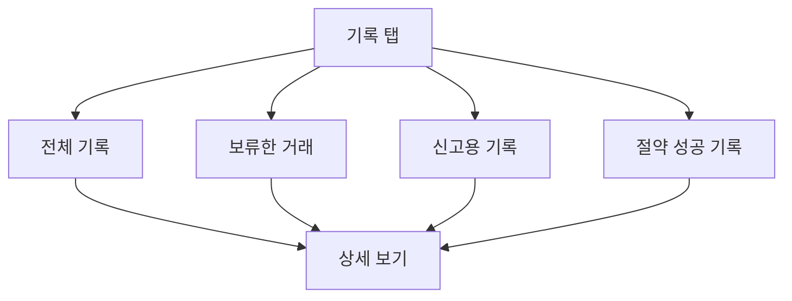
```mermaid
graph TD
    A["기록 탭"] --> B["전체 기록"]
    A --> C["보류한 거래"]
    A --> D["신고용 기록"]
    A --> E["절약 성공 기록"]
    B --> F["상세 보기"]
    C --> F
    D --> F
    E --> F
```

### 필터
- 전체
- 대출
- 카드
- 송금
- 입금
- 소비
- 자동이체
- 신고기록
- 절약기록

### 상세 화면 버튼
- 다시 분석하기
- 돈흐름 다시 보기
- 신고용 기록 저장
- 거래 메모 추가
- 완료 처리

---

## WF-15. 설정 및 보호수준 조정 워크플로우

### 목적
사용자의 상황에 맞게 경고 강도와 설명 방식을 조절한다.

### 설정 항목

| 설정 | 선택지 |
|---|---|
| 쉬운말 단계 | 보통 / 아주 쉽게 / 전문용어 함께 보기 |
| 보호모드 | 기본 / 고령층 / 외국인 / 충동소비 보호 / 중고거래 보호 |
| 쿨링오프 시간 | 1분 / 5분 / 10분 / 24시간 |
| 소비 경고 기준 | 식비 초과 / 쇼핑 초과 / 월말 잔액 부족 / 심야 결제 |
| 입금 경고 기준 | 모르는 사람 / 금액 불일치 / 반환 요청 / 위험 메모 |
| 알림 방식 | 푸시 / 배너 / 강한 경고 / 조용한 기록만 |

---

# 9. HTML 목업 구현용 화면 목록

## 9.1 필수 화면

| 화면 ID | 화면명 | 설명 |
|---|---|---|
| `home` | 홈 | 오늘 사용 가능 금액, 보호 중인 돈, 최근 위험진단 |
| `onboarding` | 시작 설정 | 사용자 유형, 보호목표, 생활비 설정 |
| `risk-input` | 위험진단 입력 | 화면 업로드, 직접 입력, 샘플 선택 |
| `risk-card` | 위험도 카드 | 행동 유형, 위험도, 핵심 위험 |
| `easy-explain` | 쉬운말 핵심설명 | 금융 용어와 약관 쉽게 설명 |
| `money-preview` | 돈흐름 미리보기 | 1개월, 3개월, 최악 상황 |
| `living-guard` | 생활비 보호모드 | 필수 생활비, 남은돈 숨김 |
| `spending-pause` | 충동소비 잠시멈춤 | 사유 입력, 10분 뒤 확인 |
| `transfer-check` | 송금 전 확인 | 계좌 명의, 거래 상대, 사기 위험 |
| `receive-check` | 의심입금 안전확인 | 수락, 보류, 반환, 신고 선택 |
| `pause` | 위험거래 잠시멈춤 | 고위험 행동 보류 및 재확인 |
| `evidence` | 신고기록 자동정리 | 신고용 기록 묶음 |
| `records` | 기록 | 경고 이력, 절약 기록, 신고 기록 |
| `settings` | 설정 | 보호모드와 알림 설정 |

## 9.2 선택 화면

| 화면 ID | 화면명 |
|---|---|
| `subscription-check` | 구독 점검 |
| `loan-calculator` | 대출 상환 계산 |
| `card-check` | 카드 발급 위험확인 |
| `business-deposit-check` | 사업자 입금 점검 |
| `saving-success` | 절약 성공 화면 |
| `language-mode` | 다국어 설명 모드 |
| `senior-mode` | 큰 글씨 보호모드 |

---

# 10. HTML 목업용 버튼 문구

| 상황 | 버튼 문구 |
|---|---|
| 분석 시작 | **위험 확인하기** |
| 약관 요약 | **핵심 위험 보기** |
| 미래 결과 확인 | **돈흐름 미리보기** |
| 생활비 설정 | **생활비 보호 시작** |
| 남은돈 숨김 | **남은돈 숨기기** |
| 소비 경고 | **잠시 멈추기** |
| 쿨링오프 | **10분 뒤 다시 확인** |
| 정상 진행 | **위험 이해하고 진행** |
| 의심입금 | **이 입금 안전확인** |
| 입금 수락 | **정상 입금으로 받기** |
| 입금 보류 | **사용하지 않고 보류하기** |
| 반환 안내 | **보낸 계좌로 돌려주기** |
| 신고자료 | **신고자료 정리하기** |
| 기록 저장 | **신고용 기록 저장** |
| 절약 기록 | **지켜낸 금액 보기** |
| 취소 | **이번 거래 취소** |

---

# 11. 목업용 샘플 시나리오 데이터

## 11.1 대출 시나리오

| 항목 | 값 |
|---|---|
| 유형 | 소액대출 |
| 대출금 | 3,000,000원 |
| 금리 | 연 12.5% |
| 기간 | 12개월 |
| 월소득 | 800,000원 |
| 기존 고정지출 | 520,000원 |
| 위험도 | 위험 신호 있음 |
| 추천 | 금액 낮추기 또는 10분 뒤 다시 확인 |

## 11.2 카드·리볼빙 시나리오

| 항목 | 값 |
|---|---|
| 유형 | 카드 발급 |
| 연회비 | 30,000원 |
| 실적 조건 | 월 500,000원 |
| 리볼빙 | 신청 가능 상태 |
| 위험도 | 확인 필요 |
| 추천 | 리볼빙 없이 발급 |

## 11.3 소비 시나리오

| 항목 | 값 |
|---|---|
| 유형 | 배달 결제 |
| 결제액 | 28,000원 |
| 주간 식비 잔액 | 18,000원 |
| 위험도 | 위험 신호 있음 |
| 추천 | 10분 뒤 다시 확인 또는 결제 취소 |

## 11.4 송금 시나리오

| 항목 | 값 |
|---|---|
| 유형 | 중고거래 송금 |
| 거래 상대 | 김OO |
| 계좌 명의 | 박OO |
| 금액 | 500,000원 |
| 위험도 | 즉시 중단 권장 |
| 추천 | 송금 취소 또는 신고자료 정리 |

## 11.5 의심입금 시나리오

| 항목 | 값 |
|---|---|
| 유형 | 낯선 입금 |
| 입금자명 | 박OO |
| 거래 상대 | 김OO |
| 입금액 | 500,000원 |
| 판매금액 | 50,000원 |
| 위험도 | 즉시 중단 권장 |
| 추천 | 사용하지 않고 보류, 신고자료 정리 |

## 11.6 자동이체 시나리오

| 항목 | 값 |
|---|---|
| 유형 | OTT 구독 |
| 월 결제액 | 18,900원 |
| 이번 달 자동결제 총액 | 74,000원 |
| 위험도 | 확인 필요 |
| 추천 | 구독 목록 확인 |

---

# 12. 목업 상태값 정의

HTML 목업에서 상태를 단순하게 관리하기 위한 예시이다.

```js
const appState = {
  userType: "사회초년생",
  protectionMode: ["생활비 보호", "중고거래 보호"],
  monthlyIncome: 1800000,
  essentialExpense: 1510000,
  protectedAmount: 200000,
  availableToday: 30000,
  savedThisMonth: 214000,
  currentScenario: "suspiciousDeposit",
  riskLevel: "즉시 중단 권장",
  lastAction: "사용하지 않고 보류하기",
  evidenceItems: []
};
```

## 12.1 위험도 값

```js
const riskLevels = [
  "안전 확인",
  "확인 필요",
  "위험 신호 있음",
  "즉시 중단 권장"
];
```

## 12.2 주요 행동 값

```js
const userActions = [
  "위험 이해하고 진행",
  "잠시 멈추기",
  "10분 뒤 다시 확인",
  "이번 거래 취소",
  "신고자료 정리하기",
  "사용하지 않고 보류하기",
  "보낸 계좌로 돌려주기"
];
```

---

# 13. 목업에서 반드시 시뮬레이션해야 하는 경우

## 13.1 위험도별 경우

| 경우 | 결과 |
|---|---|
| 안전 확인 | 바로 진행 가능 |
| 확인 필요 | 쉬운말 핵심설명 표시 |
| 위험 신호 있음 | 잠시멈춤 화면 표시 |
| 즉시 중단 권장 | 보류·취소·신고자료 정리 우선 표시 |

## 13.2 금융행동별 경우

| 행동 | 필수 시뮬레이션 |
|---|---|
| 대출 | 월 상환액, 소득 대비 부담, 연체 위험 |
| 카드 | 연회비, 실적 조건, 리볼빙 위험 |
| 자동이체 | 월 고정지출 증가, 구독 누적 |
| 소비 | 생활비 침범, 충동소비 잠시멈춤 |
| 송금 | 계좌 명의 불일치, 사기 위험 |
| 입금 | 의심입금 수락·보류·반환·신고 |
| 신고 | 증거 패키지 생성 |

## 13.3 사용자 선택별 경우

| 선택 | 화면 결과 |
|---|---|
| 진행 | “위험을 이해하고 진행했어요” 기록 |
| 보류 | 기록 탭의 보류한 거래에 저장 |
| 취소 | 절약 성공 또는 위험 회피 기록 |
| 10분 뒤 확인 | 쿨링오프 타이머 표시 |
| 신고자료 정리 | 신고기록 자동정리 화면으로 이동 |
| 정상 입금으로 받기 | 정상 거래로 기록 |
| 보낸 계좌로 돌려주기 | 원입금 반환 안내 화면 표시 |

---

# 14. 공모전 MVP 범위

## 14.1 MVP에서 반드시 구현할 기능

| 우선순위 | 기능 | 구현 방식 |
|---:|---|---|
| 1 | 금융행동 위험진단 | 샘플 데이터 기반 위험도 카드 |
| 2 | 쉬운말 핵심설명 | 약관 문장 → 쉬운말 변환 예시 |
| 3 | 돈흐름 미리보기 | 대출·카드·소비·송금 시나리오별 결과 |
| 4 | 생활비 보호모드 | 필수 생활비 계산, 남은돈 숨김, 소비 잠시멈춤 |
| 5 | 위험거래 잠시멈춤 | 고위험 거래 보류·취소·10분 뒤 확인 |
| 6 | 신고기록 자동정리 | 신고용 기록 묶음 생성 화면 |

## 14.2 MVP에서 제외해도 되는 기능

| 기능 | 제외 이유 |
|---|---|
| 실제 은행 계좌 차단 | 금융망 연동과 규제 이슈가 큼 |
| 실제 돈 이동 | MVP에서는 시뮬레이션으로 충분 |
| 실시간 오픈뱅킹 연동 | 공모전 단계에서는 샘플 데이터로 대체 |
| 실제 신고 접수 | 신고용 기록 생성까지만 구현 |
| 실제 카드·대출 가입 제어 | 위험 설명과 잠시멈춤 UX로 대체 |

---

# 15. 발표용 요약

## 15.1 기능 요약

> Finnect Guard는 **금융행동 위험진단 → 쉬운말 핵심설명 → 돈흐름 미리보기 → 생활비 보호모드 → 위험거래 잠시멈춤 → 신고기록 자동정리**의 6단계로 작동한다.

## 15.2 차별화 요약

| 기존 서비스 | 한계 | Finnect Guard의 차별점 |
|---|---|---|
| 가계부 | 소비 후 기록 중심 | 소비 전 생활비 침범을 막음 |
| 약관 요약 | 설명만 제공 | 위험도 판단과 잠시멈춤까지 연결 |
| 대출 계산기 | 숫자 계산 중심 | 최악의 상황과 생활비 영향까지 보여줌 |
| 송금 확인 | 이름 확인 정도 | 거래 맥락과 사기 위험까지 판단 |
| 사기 신고 | 사고 후 대응 | 사고 전 경고와 기록 자동정리 |

## 15.3 대표 문장

> **Finnect Guard는 금융 취약 사용자가 돈을 쓰거나 금융 버튼을 누르기 전, 그 선택의 결과를 미리 보여주고 위험하면 멈추게 하는 AI 금융 안전벨트입니다.**

---

# 16. HTML 목업 제작 체크리스트

- [ ] 스마트폰 프레임 형태로 구현
- [ ] 하단 탭 포함: 홈, 위험진단, 돈흐름, 생활비, 기록, 설정
- [ ] 6대 기능이 모두 화면에 드러나게 구현
- [ ] 위험도 4단계가 색상 또는 배지로 구분
- [ ] 대출, 카드, 소비, 송금, 의심입금, 자동이체 시나리오 선택 가능
- [ ] 생활비 보호모드에서 사용 가능 금액과 보호 중인 금액 표시
- [ ] 충동소비 잠시멈춤에서 사유 입력 가능
- [ ] 의심입금 안전확인에서 수락·보류·반환·신고 선택 가능
- [ ] 신고기록 자동정리에서 신고용 기록 묶음 표시
- [ ] 설정에서 보호모드와 쿨링오프 시간 변경 가능
- [ ] 모든 버튼 클릭 시 다음 화면 또는 상태 변화가 있어야 함
- [ ] 공모전 발표용으로 한 화면만 봐도 서비스 가치가 이해되어야 함

---

## 부록 A. 권장 UI 톤앤매너

- 토스처럼 여백이 넓고 문장이 짧은 모바일 뱅킹 스타일
- “위험합니다”보다 “이런 점을 확인해야 해요” 같은 부드러운 경고
- 금융 초보자도 이해할 수 있는 쉬운 표현
- 고위험 상황에서는 명확하고 단호한 문구 사용
- 숫자는 크게, 설명은 짧게, 선택지는 2~4개 이내로 제한

### 예시 문구

| 상황 | 문구 |
|---|---|
| 홈 | “이번 달 꼭 필요한 돈을 먼저 지켜뒀어요.” |
| 대출 | “이 대출을 받으면 매달 261,000원이 빠져나가요.” |
| 소비 | “이 결제를 하면 이번 주 식비 예산을 넘어요.” |
| 송금 | “거래 상대와 계좌 명의가 달라요.” |
| 입금 | “모르는 입금이에요. 바로 사용하지 말고 확인하세요.” |
| 신고기록 | “문제가 생길 경우를 대비해 기록을 정리했어요.” |

---

## 부록 B. 최종 기능명 고정안

```text
1. 금융행동 위험진단
2. 쉬운말 핵심설명
3. 돈흐름 미리보기
4. 생활비 보호모드
5. 위험거래 잠시멈춤
6. 신고기록 자동정리
```

